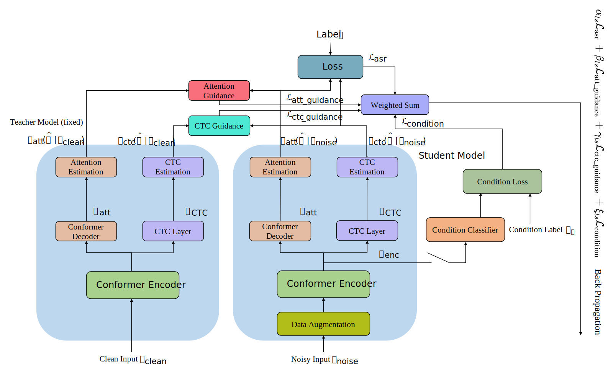

# Data Augmentation with Teacher-Student Learning for Robust Speech Recognition
## Idea
Most ASR models cannot perform well in noisy environments. One solution is to use an enhancement model which estimates a clean speech signal. The ASR model accepts the estimated signal and predicts the corresponding text. But the mismatch training targets between the two systems can degrade the performance of the ASR model.   
To solve the problems. We train a robust ASR model with the noisy training set in which each utterance is mixed with noise. Also, we use three different strategies. First, data augmentation methods provide more changeful data. Second, Adversarial sample regularization methods: fast gradient sign method (FGSM) and virtual adversarial training (VAT) are used to let the model learn a smoother output distribution. Third, teacher-student learning lets the student model learn more knowledge from the teacher model which is trained with the clean training set. Therefore, the model can perform well on the clean test set and has the ability to robust recognize the utterance in noisy environments.   
## Structure

The proposed framework has two ASR models. Teacher model and Student model. The teacher model is a well-trained model. The student model is an initialized model. In principle, the two models should have the same configurations. The only difference is that the student model will be trained with the noisy training set and the teacher model is trained with the clean training set.  
The data augmentation methods and adversarial sample regularization methods are used in training the student model to increase the robustness of the student model.  
Both the teacher model and the student model are implemented by the conformer and use the recipe from ESPnet.   
## Usage
You can use the script to start the program including downloading the datasets, training the models, and evaluating the models.   
```bash
cd ./robust_conformer
bash ./run_conformer_model.sh
```
You should change some paths in `config/config.txt`. The configurations of the models are saved in the `config` directory. You can use a pre-trained Chinese embedding matrix as the first layer of the language model. We recommend using this: [Chinese Word Vectors](https://github.com/Embedding/Chinese-Word-Vectors).    
```
config
├── config.txt
├── conformer_decode_config.yml
├── general_config.yml
├── path_config
├── teacher_student_config.yml
├── train_config.yml
└── train_conformer_kernel_15.yml

# config.txt save the general configuration such as for prepareing the feature, path information and language model configuration.
# conformer_decode_config.yml save the decoding configuration.
# general_config.yml save the basic configurations for training all the models.
# path_config automatically generated file.
# teacher_student_config.yml save the model configuration for teacher student learning.
# train_config.yml save the basic configuration for training different models.
# train_conformer_kernel_15.yml save the conformer configuration.
```
## Datasets
The default training set used in the project is AISHELL-1. The noisy training set is generated by mixing the AISHELL-1 training set with the NOISE-92 noise dataset. The models are evaluated on three different test sets. The clean test set is the original AISEHLL-1 test set. Match test set: AISHELL-1 test set mixed with NOISE-92 noise dataset. The unmatch test set: AISHELL-1 test set mixed with the noise class in the MUSAN corpus.   
You can also use different datasets to train and evaluate the model. You can use `asr_train_conf.py` to train the model and `asr_recog_conf.py` for decoding. But you need to write a script to prepare the features. `data/prep_features.py` can help to load the `.mat` or `.wav` files, automatically mix the utterances and generate the STFT features. Or Kaldi can be used for preparing the features.  
## Performance
The table shows the performance of the models in terms of CER.
|                              Model                             | Clean test set [%] | Match noisy set [%] | Unmatch noisy set [%] |
|:--------------------------------------------------------------:|:--------------:|:---------------:|:-----------------:|
|                         Baseline_Clean                         |       9.7      |       36.2      |         26        |
|                         Baseline_Noise                         |      10.4      |       15.3      |        17.9       |
|                         Model with FGSM                        |       9.8      |        15       |        17.1       |
|                         Model with VAT                         |      10.1      |       14.5      |        16.6       |
|  Model with VAT Shift SpecAugment Random-Mix Delta Delta-Delta |       8.8      |       12.5      |        14.1       |
| T/S Learning with VAT Shift SpecAugment Random-Mix Delta-Delta |       8.2      |       11.8      |        13.3       |